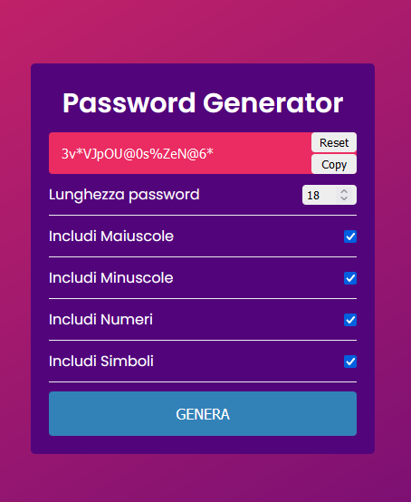
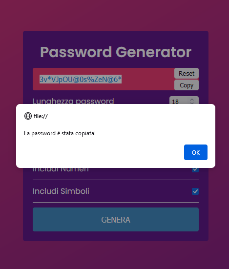
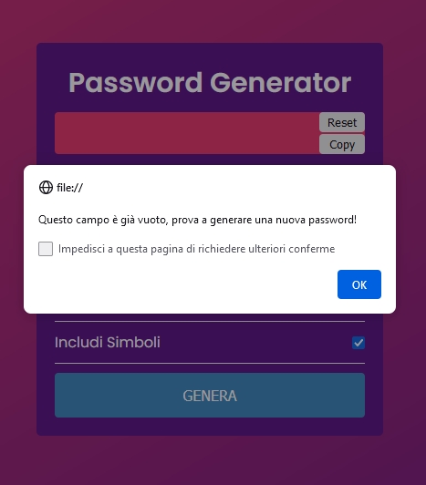

# Progetto Javascript Password generator

Progetto di medio-semplice complessità per generare una password randomica di numeri, simboli e caratteri. Tutte le funzioni e i metodi per il corretto funzionamento dell'app sono stati implementati grazie a JS Plain.

- HTML (Markup)
- CSS (Markup)
- JAVASCRIPT

Condizione iniziale dell'app.

Generazione della password al click del tasto genera

Implementazione del tasto copia

Implementazione del tasto reset

